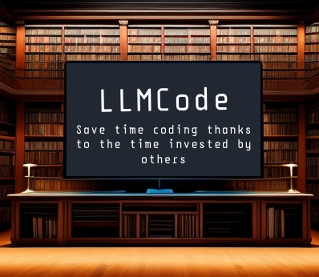

<div></div>


# LLMCode

LLMCode is a tool designed to streamline code documentation using Language Models (LLMs).
</br>
</br>
It is a user-friendly utility that harnesses the capabilities of Language Models to automatically generate code documentation. Say goodbye to the time-consuming and often tedious task of writing documentation by hand. With this tool, you can effortlessly self-updating code documentation, and then just review the work of LLMCode.
</br>
</br>

## 📋 Features

- [x] **Seamless Integraton**: LLMCode is a Python package installable via pip, compatible with various code editors, and seamlessly integrates with Git version control system.

- [x] **Customizaton**: Tailor the generated documentation to your needs by creating custom prompts. You can define the documentation format, with separate prompts for functions and classes.

- [x] **Python support**: LLMCode fully supports Python, allowing you to generate docstrings for functions and classes within your Python scripts. Document your entire project, specific scripts, or selected functions, and decide whether or not to overwrite existing documentation. All this can be achieved with straightforward CLI commands or by utilizing the Python library. Check out the [USAGE](https://javierganan99.github.io/LLMCode/usage) section for more details.

- [x] **GPT models**: LLMCode currently supports GPT models, leveraging the OpenAI API for prompt-based completions. However, for users interested in interacting with other Language Models (LLMs), it's easy to create a custom 'get_completion' method. Detailed instructions can be found in the [CUSTOM COMPLETIONS](https://javierganan99.github.io/LLMCode/customization#custom-completions) section.

## 📚 Documentation

The LLMCode documentation can be found [here](https://javierganan99.github.io/LLMCode/).

You can also serve it locally with:

```bash
pip install mkdocs mkdocstrings[python] mkdocs-autorefs mkdocs-material mkdocs-gen-files
cd path/to/LLMCode
mkdocs serve
```

Open your browser and go to `http://127.0.0.1:8000/` to view the documentation.

## 📬 Contact

Francisco Javier Gañán - fjganan14@gmail.com
